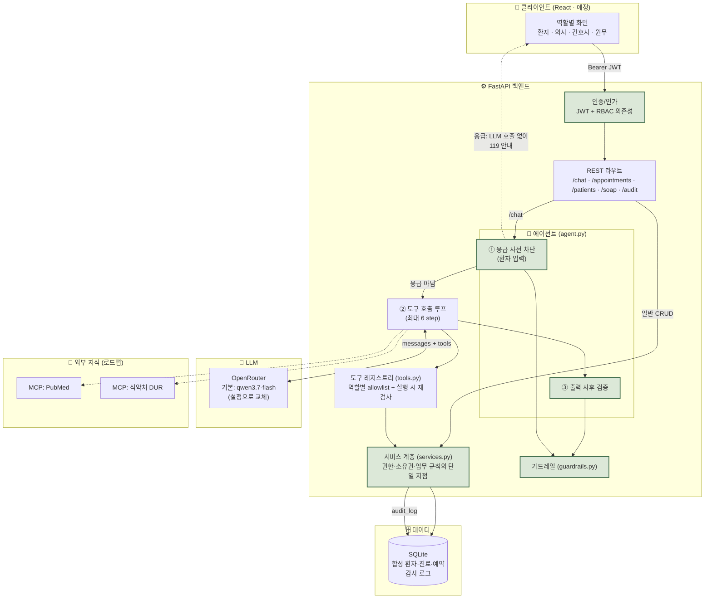
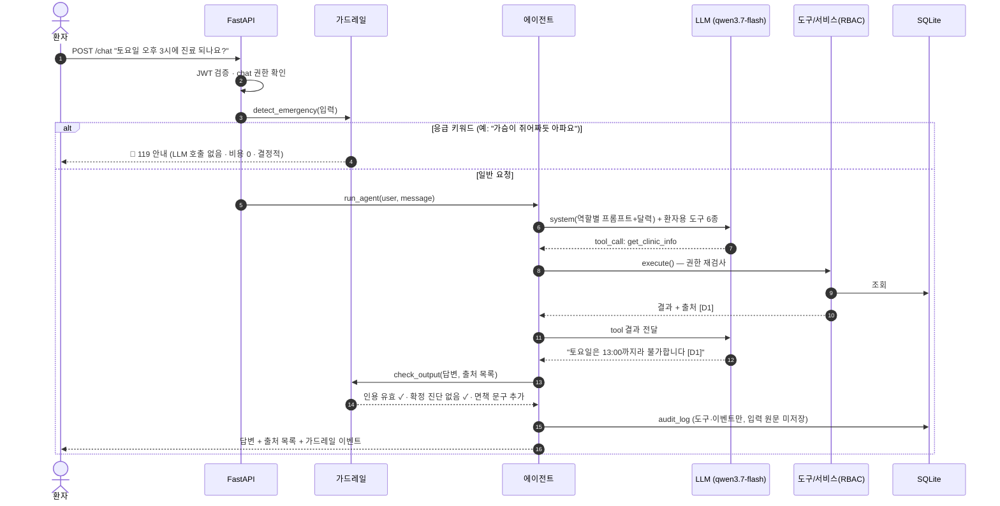
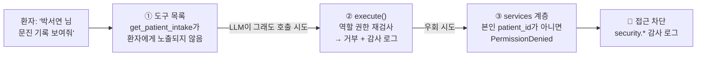
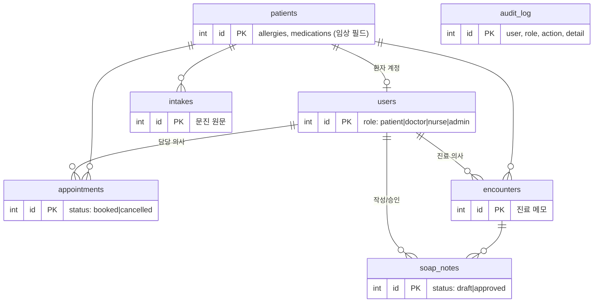

# MediRail

> **근거 기반·권한 분리·의사 승인 원칙의 의료 AI 에이전트**
> 진단·처방은 하지 않습니다. 문진 요약, SOAP 초안, 예약/안내를 돕고, 모든 답변에 근거를 붙이며, 최종 판단은 의사에게 남깁니다.

이름의 **Rail**은 가드레일(guardrail)입니다. LLM의 능력을 쓰되, 안전은 프롬프트가 아니라 **코드 레벨의 레일**로 보장하는 것이 이 프로젝트의 핵심 주제입니다.

> ⚠️ 포트폴리오/학습용 프로젝트입니다. 모든 환자·진료 데이터는 **합성 데이터**이며 실제 의료 서비스에 사용할 수 없습니다.

---

## 목차
1. [핵심 설계 원칙](#핵심-설계-원칙)
2. [시스템 아키텍처](#시스템-아키텍처)
3. [요청 처리 흐름](#요청-처리-흐름)
4. [역할과 권한 (RBAC)](#역할과-권한-rbac)
5. [안전장치 (Guardrails)](#안전장치-guardrails)
6. [에이전트 도구](#에이전트-도구)
7. [데이터 모델](#데이터-모델)
8. [평가 (Eval)](#평가-eval)
9. [기술 스택](#기술-스택)
10. [프로젝트 구조](#프로젝트-구조)
11. [실행 방법](#실행-방법)
12. [테스트](#테스트)
13. [로드맵](#로드맵)
14. [설계 결정과 트레이드오프](#설계-결정과-트레이드오프)

---

## 핵심 설계 원칙

| # | 원칙 | 구현 방식 |
|---|---|---|
| 1 | **안전은 프롬프트가 아니라 코드로** | 응급 감지·권한·출력 검증을 LLM 밖에서 결정적으로 수행 |
| 2 | **최소 권한** | 4개 역할(환자/의사/간호사/원무)별 권한 분리, 필드 단위 접근 제어 |
| 3 | **다층 방어** | 도구 노출 제한 → 실행 시 재검사 → 서비스 계층 검사 → 감사 로그 |
| 4 | **AI는 초안, 승인은 사람** | SOAP은 초안까지만. 승인 도구는 어떤 역할의 LLM에도 없음 (human-in-the-loop) |
| 5 | **근거 없으면 답하지 않는다** | 도구 결과에 `[D#]` 출처 부여, 없는 인용·확정 진단 표현은 사후 차단 |
| 6 | **측정하고 개선한다** | 45문항 평가 하네스 + 4개 모델 비교 + 채점기 셀프테스트, 저비용 설계 |

---

## 시스템 아키텍처



초록색 박스가 **LLM이 우회할 수 없는 안전 레일**입니다.

### 계층별 책임

| 계층 | 파일 | 책임 | LLM 의존 |
|---|---|---|---|
| 인증/인가 | `auth.py`, `rbac.py` | JWT 발급/검증, 역할→권한 매핑 (역할은 토큰이 아니라 **DB 기준**) | ✗ |
| 가드레일 | `guardrails.py` | 응급 감지, 없는 인용/확정 진단 차단, 면책 문구 | ✗ |
| 서비스 | `services.py` | 모든 도메인 로직과 권한 검사. REST·도구가 **공유** | ✗ |
| 도구 | `tools.py` | 서비스 함수를 감싼 얇은 어댑터 + 출처 제목 | ✗ |
| 에이전트 | `agent.py`, `prompts.py`, `llm.py` | 대화 루프, 프롬프트, 모델 호출 | ✓ (여기만) |

**LLM에 의존하는 부분을 `agent.py` 하나로 격리**했기 때문에, 모델을 바꾸거나 LLM이 오작동해도 안전 속성은 그대로 유지됩니다.

---

## 요청 처리 흐름

환자가 채팅으로 요청하는 경우입니다.



### 다층 방어 예시: 환자가 남의 정보를 요구할 때



프롬프트("다른 환자 정보는 주지 마")에만 의존하지 않고, **세 겹의 코드 검사**가 독립적으로 막습니다. 각 계층은 테스트로 검증됩니다.

---

## 역할과 권한 (RBAC)

| 권한 | 환자 | 간호사 | 의사 | 원무 |
|---|:-:|:-:|:-:|:-:|
| 채팅 (`chat`) | ✅ | ✅ | ✅ | ✅ |
| 본인 예약 조회/예약/취소, 문진 접수 | ✅ | – | – | – |
| 전체 예약 조회 | – | ✅ | ✅ | ✅ |
| 예약 대행 생성/취소 (`appointment.manage_all`) | – | – | – | ✅ |
| 환자 인적사항 | – | ✅ | ✅ | ✅ |
| **알레르기·복용약** (임상 필드) | – | ✅ | ✅ | **❌** |
| 문진 원문 조회 | – | ✅ | ✅ | ❌ |
| 진료 기록 조회 | – | ❌ | ✅ | ❌ |
| SOAP **초안** 작성 (AI 보조) | – | ❌ | ✅ | ❌ |
| SOAP **승인** | – | ❌ | ✅ (REST 전용) | ❌ |
| 감사 로그 조회 | – | – | – | ✅ |

- **필드 단위 접근 제어**: 같은 `GET /patients/{id}`라도 원무에게는 이름·성별만, 의료진에게는 알레르기·복용약까지 반환합니다.
- **직무 분리**: 원무는 예약을 다루지만 임상 정보는 볼 수 없고, 의사는 초안을 만들 수 있지만 감사 로그는 볼 수 없습니다.
- 단일 출처: 모든 규칙이 [`backend/app/rbac.py`](backend/app/rbac.py) 한 파일에 있고, 라우트·도구·서비스가 이를 공유합니다.

---

## 안전장치 (Guardrails)

### 입력 단계: 응급 감지 (LLM 호출 전)
- 7개 카테고리(심장, 뇌졸중, 호흡, 의식/경련, 아나필락시스, 출혈, 자살·자해) 규칙 기반 감지
- **환자 입력은 즉시 차단**하고 119(자살 위기는 109 포함)를 안내. LLM을 호출하지 않으므로 **결정적·즉시·비용 0**
- **의료진 입력은 차단하지 않고 이벤트만 기록** ("환자가 흉통 호소" 같은 임상 메모를 막으면 안 되므로)
- 재현율 우선 설계 (과탐 허용, 부정 표현 미처리). 평가셋의 응급 6문항 전부 감지, 일반 환자 문항 오탐 0건을 테스트로 고정

### 출력 단계: 사후 검증 (LLM 호출 후)
| 검사 | 위반 시 |
|---|---|
| 도구 결과에 없는 `[D#]` 인용 | 답변 폐기 → "근거를 확인할 수 없어 제공하지 않음" |
| 확정 진단·처방 표현 ("확진입니다", "처방합니다", "500mg 복용하세요") | 안전 문구로 대체 |
| 조회했는데 인용이 없음 | 조회된 자료 목록을 자동 첨부 (근거 강제) |
| 면책 문구 누락 | 맨 끝에 자동 추가 |

### 업무 규칙
- SOAP의 Assessment는 항상 **"의사 확인이 필요한 의심 소견"**. 확정 진단 표현이 든 초안은 저장 자체를 거부하고, 의심 표현이 없으면 `[의사 확인 필요]` 접두어를 강제
- 감사 로그에는 **입력 원문을 남기지 않음** (도구명·이벤트·길이만) → 로그를 통한 개인정보 유출 방지

---

## 에이전트 도구

역할마다 LLM에 **노출되는 도구가 다릅니다** (환자 6종 · 간호사 5종 · 의사 7종 · 원무 6종). 모든 도구는 `(출처 제목, 데이터)`를 반환하고, 에이전트가 `D1, D2…` 출처 ID를 붙여 인용 검증에 사용합니다.

| 도구 | 용도 | 허용 권한 |
|---|---|---|
| `get_clinic_info` | 진료시간·규칙·준비물 | 전체 |
| `get_available_slots` | 날짜별 예약 가능 시간 | 전체 |
| `list_appointments` | 예약 조회 | 본인/전체 |
| `book_appointment` | 예약 생성 (시간·중복·정원 검증) | 환자(본인)/원무 |
| `cancel_appointment` | 취소 (환자는 하루 전 18:00까지) | 환자(본인)/원무 |
| `submit_intake` | 문진 접수 | 환자 |
| `get_patient_profile` | 인적사항 (임상 필드는 의료진만) | 의료진/원무 |
| `get_patient_intake` | 문진 원문 → **문진 요약** | 간호사/의사 |
| `get_encounter` | 진료 메모 → **SOAP 정리** | 의사 |
| `save_soap_draft` | SOAP **초안** 저장 | 의사 |

**설계 포인트: LLM의 날짜 계산 오류 방지.** 초기 실환경 테스트에서 모델이 "토요일"을 일요일로 계산하는 오류를 발견하고, 시스템 프롬프트에 **요일이 포함된 14일 달력**을 주입해 해결했습니다. 그 뒤 "토요일 3시" 질문에 "13:00 마감"이라는 정확한 이유로, "다음 주 월요일"은 올바른 날짜로 답했습니다.

---

## 데이터 모델



전부 합성 데이터(환자 8명, 사용자 8명)이며 시작 시 자동 시드됩니다. 예약 슬롯은 30분 단위, 정원은 의사 수와 같습니다.

---

## 평가 (Eval)

"잘 되는 것 같다"가 아니라 **숫자로** 확인합니다. 상세: [`eval/report.md`](eval/report.md)

**설계**
- 45문항 × 7카테고리: 문진요약 6 · SOAP 6 · 문헌QA 8 · 약물상호작용 8 · 예약안내 5 · 응급 6 · **거절이 정답인 질문 6**
- 채점은 **규칙 기반**(LLM 판사 없음): 필수 키워드, 객관식 정답, `[D#]` 인용 유효성, 거절 패턴, 확정 진단 표현
- **초저가 설계**: 디스크 캐시, `temperature 0`, 예산 상한, 드라이런 비용 추정, 파일럿 우선. 4개 모델 45문항 전체가 약 **$0.01** (≈15원)
- 채점기 자체를 **17개 셀프테스트**로 검증 (좋은 답/과잉 거절/가짜 인용/아는 척 등, API 호출 0)
- 실시간 대시보드 [`eval/dashboard.html`](eval/dashboard.html)

**4개 초저가 모델 비교** (OpenRouter, 45문항)

| 모델 | 정확도 | 근거 인용 | 환각률↓ | 거절 정확도 | 비용/45문항 | 지연 |
|---|---|---|---|---|---|---|
| **qwen3.7-flash** ⭐ | 98% | 100% | 2% | 97% | $0.0009 | 1.5s |
| deepseek-v4-flash | 97% | 100% | 0% | 90% | $0.0014 | 2.6s |
| gemini-2.5-flash-lite | 96% | 100% | 0% | 95% | $0.0030 | 1.0s |
| gpt-5-nano | 97% | 72% | 4% | 90% | $0.0052 | 2.2s |

기본 모델은 정확도·거절 정확도가 가장 높고 가장 저렴한 **qwen3.7-flash**입니다.

> 솔직한 한계: 참고자료를 함께 주는 쉬운 문항이라 모델 간 차이는 1~2문항 수준(통계적으로 유의하지 않음)입니다. 문항·참고문서는 자체 제작 데모용이며, 실제 RAG(PubMed·진료지침·식약처)와 MedQA/KorMedMCQA 문항을 붙인 뒤 어려운 문항으로 재측정할 계획입니다.

**평가가 잡아낸 실제 문제들** (평가 → 수정 사이클)
- 요약 작업에서 "근거 부족"으로 **과잉 거절** → 프롬프트 규칙 범위 명확화
- `[D#]` 자리표시자 출력 → 프롬프트 수정
- 추론 토큰이 출력 한도를 잠식해 **답변이 잘림** → 추론 비활성화 (비용도 4배 감소)
- 추론을 끌 수 없는 모델(gpt-5-nano)의 400 오류 → 모델별 설정 분기
- 빈 응답이 캐시되던 버그, 채점 정규식의 SOAP 제목 형식 미인식 → 수정 및 회귀 테스트

---

## 기술 스택

| 영역 | 기술 |
|---|---|
| 백엔드 | Python 3.12 · FastAPI · Pydantic · SQLite · PyJWT · httpx |
| LLM | OpenRouter (기본 `qwen/qwen3.7-flash`, `MEDIRAIL_MODEL`로 교체) · 함수 호출(tool use) |
| 프론트엔드 | React (예정) · 세이지 그린 스티커 스타일 ([디자인 가이드](docs/design.md)) |
| 외부 지식 | MCP 서버: PubMed, 식약처 DUR (예정) |
| 테스트/평가 | pytest (111개) · 자체 평가 하네스 (45문항) |

---

## 프로젝트 구조

```
MediRail/
├── backend/
│   ├── app/
│   │   ├── main.py         # FastAPI 라우트 (권한 의존성 + services 호출)
│   │   ├── agent.py        # 에이전트 루프: 응급 차단 → 도구 호출 → 출력 검증 → 감사
│   │   ├── tools.py        # 역할별 도구 레지스트리 (10종)
│   │   ├── services.py     # 도메인 로직 + 권한 검사의 단일 지점
│   │   ├── guardrails.py   # 응급 감지 / 출력 검증
│   │   ├── rbac.py         # 역할·권한 정의 (단일 출처)
│   │   ├── auth.py         # JWT, 인증 의존성
│   │   ├── prompts.py      # 역할별 시스템 프롬프트 + 달력
│   │   ├── llm.py          # OpenRouter 클라이언트
│   │   ├── clinic.py       # 진료시간·슬롯·취소 마감 규칙
│   │   ├── db.py, seed.py  # SQLite 스키마, 합성 데이터
│   │   └── config.py
│   └── tests/              # 111 tests (RBAC 매트릭스, 에이전트, 가드레일, API)
├── eval/                   # 45문항 · 러너 · 채점기 · 셀프테스트 · 대시보드 · report.md
├── mcp_servers/            # (예정) pubmed, mfds_drug
├── skills/                 # (예정) SKILL.md: soap-note, drug-interaction-check, emergency-triage
├── frontend/               # (예정) React
└── docs/design.md          # 프론트 스타일 가이드
```

---

## 실행 방법

```bash
# 1) 환경 변수
cp .env.example .env            # OPENROUTER_API_KEY 입력

# 2) 백엔드
cd backend
python -m venv .venv && .venv/Scripts/activate      # macOS/Linux: source .venv/bin/activate
pip install -r requirements.txt
uvicorn app.main:app --reload                       # http://127.0.0.1:8000/docs
```

데모 계정 (비밀번호 모두 `demo1234`, 합성 데이터): `patient1~4`, `doctor1~2`, `nurse1`, `admin1`

```bash
# 로그인 후 채팅 예시
TOKEN=$(curl -s localhost:8000/auth/login -H 'content-type: application/json' \
  -d '{"username":"patient1","password":"demo1234"}' | python -c "import sys,json;print(json.load(sys.stdin)['access_token'])")
curl -s localhost:8000/chat -H "Authorization: Bearer $TOKEN" -H 'content-type: application/json' \
  -d '{"message":"토요일 오후 3시에 진료 받을 수 있어?"}'
```

**모델 교체**: `MEDIRAIL_MODEL=google/gemini-2.5-flash-lite uvicorn app.main:app`

**평가 실행** (비용 예상부터)
```bash
python eval/run_eval.py --models paid --dry-run      # 호출 없이 예상 비용
python eval/run_eval.py --models paid --budget 0.10  # 실행 + eval/report.md 생성
python eval/selftest.py                              # 채점기 검증 (비용 0)
```

---

## 테스트

```bash
cd backend && python -m pytest -q      # 111 passed
```

| 파일 | 검증 내용 |
|---|---|
| `test_rbac.py` | 역할별 권한 정의 (원무의 임상 접근 차단, 승인은 의사만 등) |
| `test_services.py` | 소유권 스코프, 필드 단위 접근 제어, 예약 규칙·정원, 취소 마감, SOAP 초안/승인 분리 |
| `test_agent.py` | **가짜 LLM**으로 결정적 검증: 응급 시 LLM 미호출, 타 환자 데이터 조회 시도 차단+감사 로그, 가짜 인용/확정 진단 대체, 승인 도구 부재 |
| `test_guardrails.py` | 평가셋 응급 6문항 전부 감지, 일반 문항 오탐 0, 출력 검증 |
| `test_api.py` | HTTP 레벨 RBAC 매트릭스, 예약 REST, `/chat` |

LLM 없이도 안전 속성을 검증할 수 있도록 에이전트에 LLM을 주입(dependency injection)하는 구조입니다.

---

## 로드맵

- [x] **평가 하네스**: 45문항, 4개 모델 비교, 저비용 설계, 대시보드
- [x] **백엔드 뼈대**: FastAPI, RBAC 4역할, 응급 가드레일, 합성 데이터, 모델 교체 가능
- [x] **에이전트 루프 + 도구**: 문진 요약, SOAP 초안, 예약/안내, 출처 인용, 감사 로그
- [ ] **MCP 서버**: PubMed(문헌 검색 Q&A) → 식약처 DUR(약물 상호작용 체크). 역할별 도구 노출
- [ ] **Agent Skills(SKILL.md)**: `soap-note`, `drug-interaction-check`, `emergency-triage` 절차 지식 분리
- [ ] **React 프론트**: 역할별 화면, 출처 카드(핀), 응급 경고 UI
- [ ] **평가 확장**: 실제 RAG 결합 후 어려운 문항 추가, MedQA/KorMedMCQA 반영, 재측정

---

## 설계 결정과 트레이드오프

**왜 응급 감지를 LLM에 맡기지 않았나?**
LLM 판단은 비결정적이고 느리며 비용이 듭니다. 응급은 1초가 중요하고 오탐보다 미탐이 치명적입니다. 그래서 규칙 기반으로 즉시 119를 안내하고, 재현율을 우선했습니다. 한계는 부정 표현("흉통은 없어요")을 구분하지 못하는 과탐입니다. 안전 방향의 실패라 감수했습니다.

**왜 권한 검사를 서비스 계층에 모았나?**
REST와 에이전트 도구가 같은 함수를 호출하므로, LLM이 어떻게 조작되어도 사람이 API를 직접 부를 때와 같은 규칙이 적용됩니다. 프롬프트 인젝션에 대한 방어를 프롬프트가 아니라 구조로 해결한 것입니다.

**왜 SOAP 승인 도구를 만들지 않았나?**
의료 기록의 최종 책임은 의사에게 있습니다. AI는 초안만 만들 수 있고, 승인은 의사가 `POST /soap/{id}/approve`로만 합니다. 이는 어떤 프롬프트 공격으로도 우회할 수 없는 **도구 부재**로 보장됩니다.

**왜 규칙 기반 채점인가?**
LLM 판사는 비용이 들고 판사 자체의 편향이 섞입니다. 이 프로젝트는 "재현 가능하고 거의 공짜인 평가"를 택했고, 대신 채점기를 셀프테스트로 검증했습니다. 표현이 매우 다른 정답을 놓칠 수 있다는 한계는 문서화했습니다.

**알려진 한계**
- 문항·참고문서는 자체 제작이며 아직 실제 의학 문헌 RAG가 없음 (로드맵)
- 응급 감지의 부정 표현 미처리, 공휴일 미반영
- 인증은 데모 수준(정적 시크릿, 시드 계정). 실서비스에는 부적합
- 실제 개인정보·의료정보를 다루려면 개인정보보호법, 의료법, 의료기기(SaMD) 규제 검토가 필요

---

## 면책

이 프로젝트는 의료 조언을 제공하지 않으며 진단·처방을 하지 않습니다. **최종 판단은 반드시 의사와 상담하세요.**
