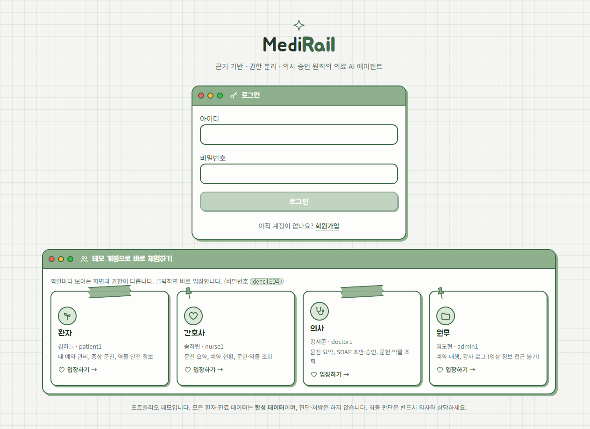
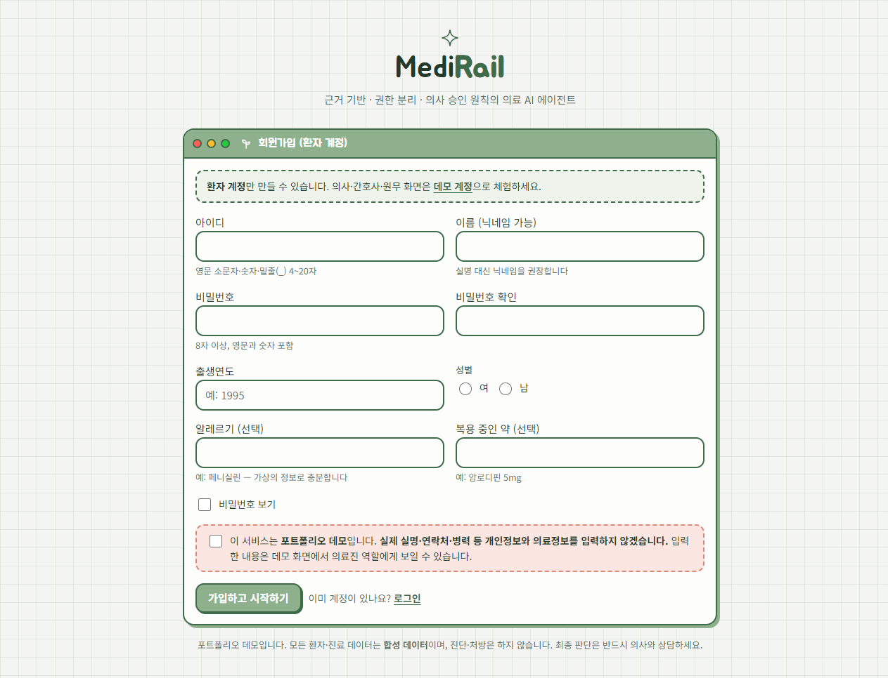
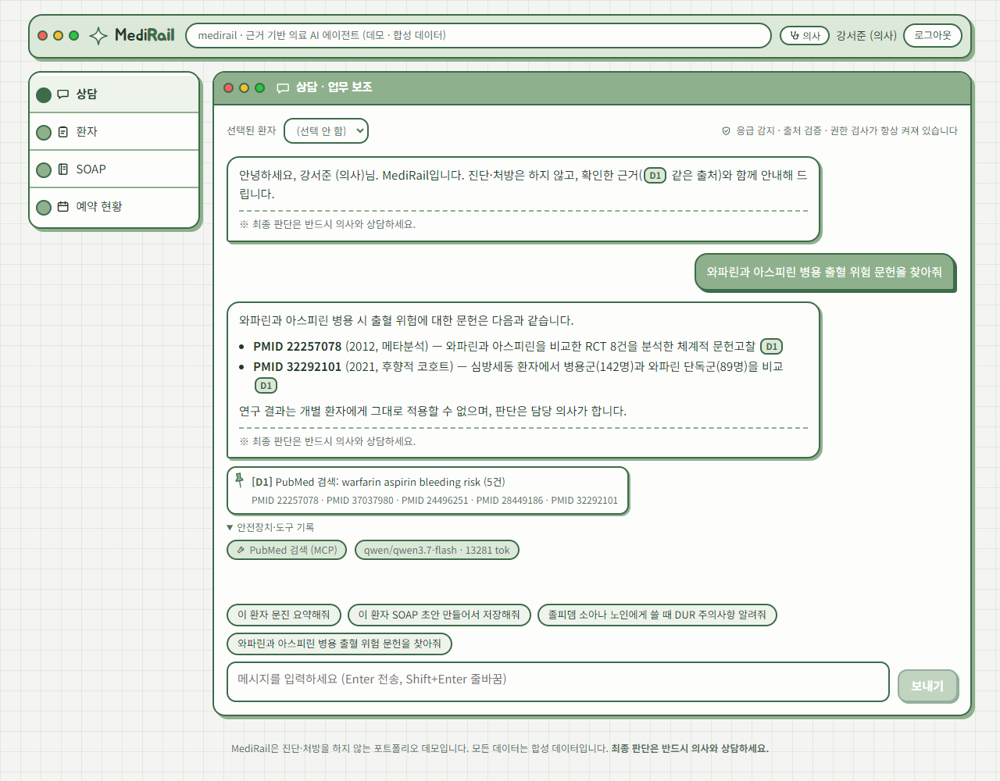
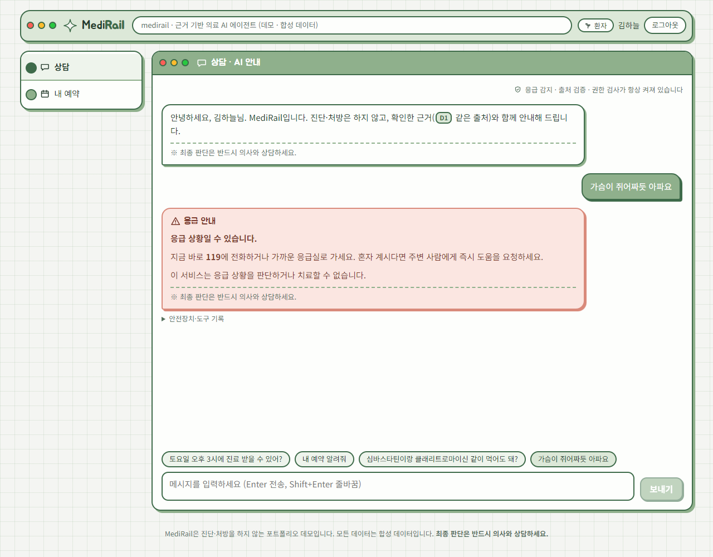
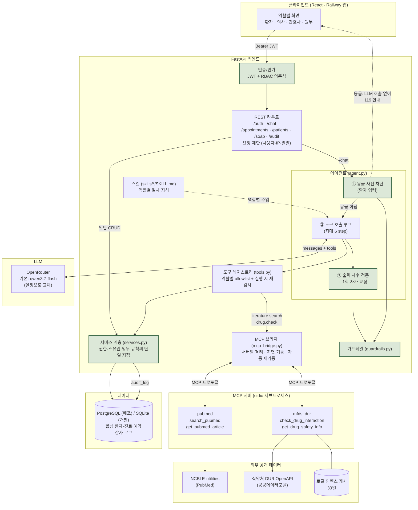
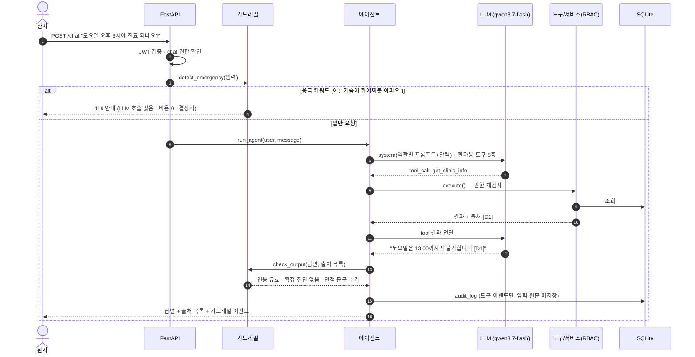
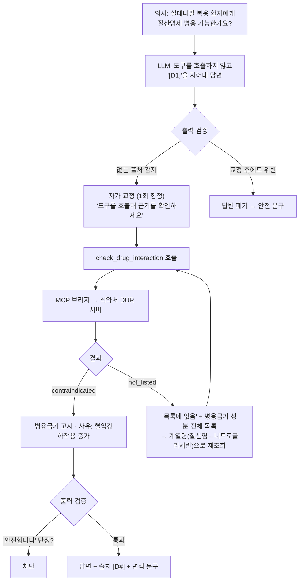
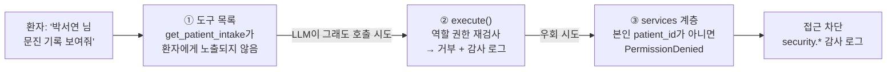
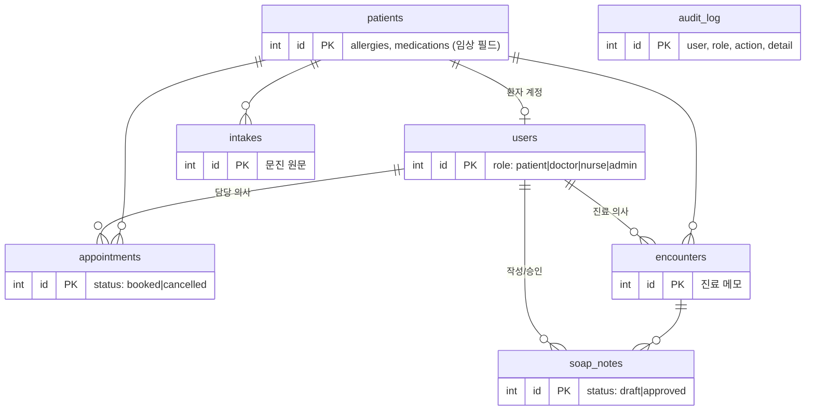
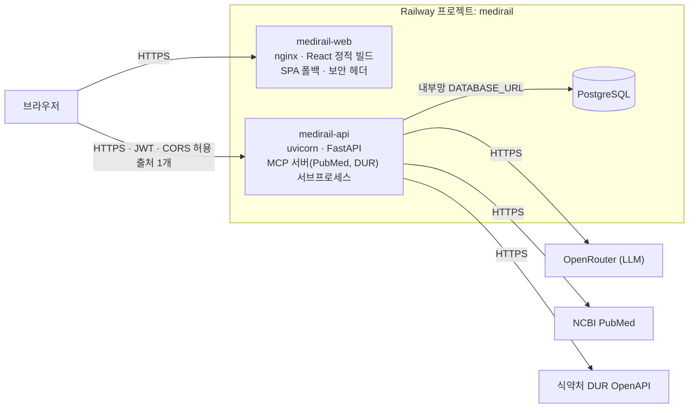

# MediRail

> **근거 기반·권한 분리·의사 승인 원칙의 의료 AI 에이전트**
> 진단·처방은 하지 않습니다. 문진 요약, SOAP 초안, 예약/안내, 의학 문헌 검색, 약물 상호작용(식약처 DUR) 조회를 돕고, 모든 답변에 근거를 붙이며, 최종 판단은 의사에게 남깁니다.

이름의 **Rail**은 가드레일(guardrail)입니다. LLM의 능력을 쓰되, 안전은 프롬프트가 아니라 **코드 레벨의 레일**로 보장하는 것이 이 프로젝트의 핵심 주제입니다.

> 포트폴리오/학습용 프로젝트입니다. 모든 환자·진료 데이터는 **합성 데이터**이며 실제 의료 서비스에 사용할 수 없습니다.

> **라이브 데모: <https://medirail-web-production.up.railway.app>**
> 로그인 화면 아래의 **데모 계정**(환자·간호사·의사·원무)으로 바로 체험할 수 있고, 회원가입은 환자 계정만 가능합니다. (Railway: 웹 + API + PostgreSQL)

| 로그인 — 아래에 데모 계정 | 회원가입 (환자 전용) |
|:-:|:-:|
|  |  |
| **의사: PubMed 문헌 검색 (MCP)** | **환자: 응급 문장은 LLM 없이 즉시 119 안내** |
|  |  |

---

## 목차
1. [핵심 설계 원칙](#핵심-설계-원칙)
2. [시스템 아키텍처](#시스템-아키텍처)
3. [요청 처리 흐름](#요청-처리-흐름)
4. [역할과 권한 (RBAC)](#역할과-권한-rbac)
5. [안전장치 (Guardrails)](#안전장치-guardrails)
6. [에이전트 도구](#에이전트-도구)
7. [MCP 서버](#mcp-서버)
8. [실환경 테스트가 잡아낸 문제들](#실환경-테스트가-잡아낸-문제들)
9. [데이터 모델](#데이터-모델)
10. [평가 (Eval)](#평가-eval)
11. [기술 스택](#기술-스택)
12. [프로젝트 구조](#프로젝트-구조)
13. [실행 방법](#실행-방법)
14. [배포 (Railway)](#배포-railway)
15. [테스트](#테스트)
16. [로드맵](#로드맵)
17. [설계 결정과 트레이드오프](#설계-결정과-트레이드오프)

---

## 핵심 설계 원칙

| # | 원칙 | 구현 방식 |
|---|---|---|
| 1 | **안전은 프롬프트가 아니라 코드로** | 응급 감지·권한·출력 검증을 LLM 밖에서 결정적으로 수행 |
| 2 | **최소 권한** | 4개 역할(환자/의사/간호사/원무)별 권한 분리, 필드 단위 접근 제어 |
| 3 | **다층 방어** | 도구 노출 제한 → 실행 시 재검사 → 서비스 계층 검사 → 감사 로그 |
| 4 | **AI는 초안, 승인은 사람** | SOAP은 초안까지만. 승인 도구는 어떤 역할의 LLM에도 없음 (human-in-the-loop) |
| 5 | **근거 없으면 답하지 않는다** | 도구 결과에 `[D#]` 출처 부여, 없는 인용·논문 번호·확정 진단·'안전' 단정은 사후 차단 |
| 6 | **"없음"은 "안전"이 아니다** | DUR 병용금기 목록에 없다는 결과에 고지문을 붙이고 '안전합니다' 류 단정을 차단 |
| 7 | **측정하고 개선한다** | 45문항 평가 하네스 + 4개 모델 비교, 실환경 테스트로 발견한 사고를 회귀 테스트로 고정 |

---

## 시스템 아키텍처



초록색 박스가 **LLM이 우회할 수 없는 안전 레일**입니다.

### 계층별 책임

| 계층 | 파일 | 책임 | LLM 의존 |
|---|---|---|---|
| 인증/인가 | `auth.py`, `rbac.py` | JWT 발급/검증, 역할→권한 매핑 (역할은 토큰이 아니라 **DB 기준**) | |
| 가드레일 | `guardrails.py` | 응급 감지, 없는 인용/논문 번호/확정 진단/안전 단정 차단, 면책 문구 | |
| 서비스 | `services.py` | 모든 도메인 로직과 권한 검사. REST·도구가 **공유** | |
| 도구 | `tools.py` | 서비스·MCP를 감싼 얇은 어댑터 + 출처 제목 | |
| MCP 브리지 | `mcp_bridge.py` | 외부 지식 서버 호출, 장애 격리·재기동 | |
| MCP 서버 | `mcp_servers/*` | PubMed, 식약처 DUR (독립 실행 가능, 어떤 MCP 클라이언트에서도 사용) | |
| 요청 제한 | `ratelimit.py` | 사용자별·IP별·일일 전체 상한 (공개 데모의 LLM 비용 남용 방지). 응급 안내는 제한하지 않음 | |
| 스킬 | `skills.py`, `skills/*/SKILL.md` | 역할별 절차 지식(SOAP·문진·약물·문헌·응급)을 표준 SKILL.md로 관리하고 시스템 프롬프트에 주입 | |
| DB | `db.py` | SQLite(개발)·PostgreSQL(배포) 겸용 어댑터. 서비스 코드는 두 DB를 구분하지 않음 | |
| 에이전트 | `agent.py`, `prompts.py`, `llm.py` | 대화 루프, 자가 교정, 프롬프트, 모델 호출 | (여기만) |

**LLM에 의존하는 부분을 `agent.py` 하나로 격리**했기 때문에, 모델을 바꾸거나 LLM이 오작동해도 안전 속성은 그대로 유지됩니다.

---

## 요청 처리 흐름

환자가 채팅으로 요청하는 경우입니다.



### 약물 상호작용 흐름: 자가 교정 + 외부 데이터 (MCP)

실환경에서 관찰된 흐름입니다. 모델이 도구를 호출하지 않고 출처를 지어내면 폐기하는 대신 **한 번 교정 기회**를 줍니다.



### 다층 방어 예시: 환자가 남의 정보를 요구할 때



프롬프트("다른 환자 정보는 주지 마")에만 의존하지 않고, **세 겹의 코드 검사**가 독립적으로 막습니다. 각 계층은 테스트로 검증됩니다.

---

## 역할과 권한 (RBAC)

| 권한 | 환자 | 간호사 | 의사 | 원무 |
|---|:-:|:-:|:-:|:-:|
| 채팅 (`chat`) | ● | ● | ● | ● |
| 본인 예약 조회/예약/취소, 문진 접수 | ● | – | – | – |
| 전체 예약 조회 | – | ● | ● | ● |
| 예약 대행 생성/취소 (`appointment.manage_all`) | – | – | – | ● |
| 환자 인적사항 | – | ● | ● | ● |
| **알레르기·복용약** (임상 필드) | – | ● | ● | **** |
| 문진 원문 조회 | – | ● | ● | |
| 진료 기록 조회 | – | | ● | |
| SOAP **초안** 작성 (AI 보조) | – | | ● | |
| SOAP **승인** | – | | ● (REST 전용) | |
| 의학 문헌 검색 (PubMed) | | ● | ● | |
| 약물 상호작용·안전 정보 조회 (식약처 DUR) | ● | ● | ● | |
| 감사 로그 조회 | – | – | – | ● |

범례: ● 허용 · – 해당 없음 · ✕ 차단(임상 정보 등)

- **필드 단위 접근 제어**: 같은 `GET /patients/{id}`라도 원무에게는 이름·성별만, 의료진에게는 알레르기·복용약까지 반환합니다.
- **직무 분리**: 원무는 예약을 다루지만 임상 정보는 볼 수 없고, 의사는 초안을 만들 수 있지만 감사 로그는 볼 수 없습니다.
- **문헌은 의료진만, 약물 안전 정보는 환자에게도**: 논문 초록은 비전문가가 오해하기 쉬워 의료진에게만 열고, 식약처가 공식 고시한 DUR 정보는 환자도 조회할 수 있게 하되 "복용 변경은 의사·약사와"를 강제합니다.
- **회원가입은 환자 계정만**: 의사·간호사·원무는 스스로 만들 수 없습니다. 요청 본문에 `role`을 넣어도 무시되며(권한 상승 방지), 새 환자는 본인 데이터만 볼 수 있습니다. `doctor*`·`admin*` 같은 직원 사칭 아이디는 차단하고, IP당 가입 횟수와 전체 계정 수를 제한합니다.
- 단일 출처: 모든 규칙이 [`backend/app/rbac.py`](backend/app/rbac.py) 한 파일에 있고, 라우트·도구·서비스가 이를 공유합니다.

---

## 안전장치 (Guardrails)

### 입력 단계: 응급 감지 (LLM 호출 전)
- 7개 카테고리(심장, 뇌졸중, 호흡, 의식/경련, 아나필락시스, 출혈, 자살·자해) 규칙 기반 감지
- **환자 입력은 즉시 차단**하고 119(자살 위기는 109 포함)를 안내. LLM을 호출하지 않으므로 **결정적·즉시·비용 0**
- **의료진 입력은 차단하지 않고 이벤트만 기록** ("환자가 흉통 호소" 같은 임상 메모를 막으면 안 되므로)
- 재현율 우선 설계 (과탐 허용, 부정 표현 미처리). 평가셋의 응급 6문항 전부 감지, 일반 환자 문항 오탐 0건을 테스트로 고정

### 출력 단계: 사후 검증 (LLM 호출 후)
| 검사 | 위반 시 |
|---|---|
| 도구 결과에 없는 `[D#]` 인용 | 교정 1회 → 반복되면 폐기 |
| **도구가 돌려주지 않은 논문 번호(PMID)** (사용자가 직접 말한 번호는 허용) | 교정 1회 → 반복되면 폐기 |
| 확정 진단·처방 표현 ("확진입니다", "처방합니다", "500mg 복용하세요") | 교정 1회 → 반복되면 안전 문구로 대체 |
| **약물 병용·복용의 '안전' 단정** ("같이 드셔도 괜찮습니다") | 교정 1회 → 반복되면 "안전 여부는 보증할 수 없습니다"로 대체 |
| 조회했는데 인용이 없음 | 조회된 자료 목록을 자동 첨부 (근거 강제) |
| 면책 문구 누락 | 맨 끝에 자동 추가 |

### 자가 교정 (self-repair)
검증에 실패하면 곧바로 폐기하지 않고, **위반 사유를 알려 1회 다시 쓰게** 합니다. 실환경에서 모델이 도구를 호출하지 않고 `[D1]`을 지어내 답변이 통째로 폐기되던 문제를 해결했습니다. 재시도는 **1회로 제한**하고(무한 루프 방지), 반복 위반은 여전히 폐기합니다.

### 요청 제한 (공개 데모 보호)
| 대상 | 기본 상한 | 초과 시 |
|---|---|---|
| AI 대화: 사용자별 | 시간당 30회 | HTTP 429 + 재시도 안내 (LLM 호출 없음) |
| AI 대화: IP별 | 시간당 60회 | 〃 (Railway 프록시의 `X-Forwarded-For` 기준) |
| AI 대화: 전체 | 하루 200회 (배포 설정) | "오늘의 데모 AI 사용 한도에 도달했습니다" |
| 로그인 시도 | IP당 분당 10회 | 429 |
| 회원가입 | IP당 시간당 5회, 전체 계정 300개 | 429 / 안내 |

**응급 안내는 제한하지 않습니다.** 한도가 소진되어도 환자의 응급 문장에는 항상 119 안내가 나갑니다 (LLM을 호출하지 않으므로 비용이 없고, 안전이 비용보다 우선). 이 동작을 테스트로 고정했습니다.

### 업무 규칙
- SOAP의 Assessment는 항상 **"의사 확인이 필요한 의심 소견"**. 확정 진단 표현이 든 초안은 저장 자체를 거부하고, 의심 표현이 없으면 `[의사 확인 필요]` 접두어를 강제
- 감사 로그에는 **입력 원문·약물명·검색어를 남기지 않음** (도구명·이벤트·길이만) → 로그를 통한 개인정보·복약 정보 유출 방지

---

## 에이전트 도구

역할마다 LLM에 **노출되는 도구가 다릅니다** (환자 8종 · 간호사 8종 · 의사 10종 · 원무 6종, 전체 13종). 모든 도구는 `(출처 제목, 데이터)`를 반환하고, 에이전트가 `D1, D2…` 출처 ID를 붙여 인용 검증에 사용합니다.

| 도구 | 용도 | 허용 권한 | 구현 |
|---|---|---|---|
| `get_clinic_info` | 진료시간·규칙·준비물 | 전체 | 내장 |
| `get_available_slots` | 날짜별 예약 가능 시간 | 전체 | 내장 |
| `list_appointments` | 예약 조회 | 본인/전체 | 내장 |
| `book_appointment` | 예약 생성 (시간·중복·정원 검증) | 환자(본인)/원무 | 내장 |
| `cancel_appointment` | 취소 (환자는 하루 전 18:00까지) | 환자(본인)/원무 | 내장 |
| `submit_intake` | 문진 접수 | 환자 | 내장 |
| `get_patient_profile` | 인적사항 (임상 필드는 의료진만) | 의료진/원무 | 내장 |
| `get_patient_intake` | 문진 원문 → **문진 요약** | 간호사/의사 | 내장 |
| `get_encounter` | 진료 메모 → **SOAP 정리** | 의사 | 내장 |
| `save_soap_draft` | SOAP **초안** 저장 | 의사 | 내장 |
| `search_medical_literature` | PubMed 논문 검색·초록 | 간호사/의사 | **MCP** |
| `check_drug_interaction` | 두 약물의 병용금기 조회 | 환자/간호사/의사 | **MCP** |
| `get_drug_safety_info` | 임부금기·노인주의·용량주의 등 | 환자/간호사/의사 | **MCP** |

---

## MCP 서버

외부 지식은 **MCP(Model Context Protocol) 서버**로 분리했습니다. 각 서버는 독립 프로세스(stdio)로 동작하며, MediRail 백엔드뿐 아니라 Claude Code·Claude Desktop 등 **어떤 MCP 클라이언트에서도** 그대로 쓸 수 있습니다.

```bash
# Claude Code에 붙이기 (MediRail 루트에서)
claude mcp add pubmed   -- python -m mcp_servers.pubmed.server
claude mcp add mfds-dur -- python -m mcp_servers.mfds_dur.server     # DATA_GO_KR_API_KEY 필요
```

**백엔드 연동** ([`mcp_bridge.py`](backend/app/mcp_bridge.py)): 동기 에이전트 루프에서 쓰기 위해 전용 스레드의 asyncio 루프에 MCP 세션을 유지합니다. 서버는 첫 호출 때 지연 기동하고, **서버별로 격리**되어 한 서버가 시작에 실패해도 다른 서버는 정상 동작하며, 프로세스가 죽으면 다음 호출에서 자동 재기동합니다. 실제 서브프로세스로 9개 테스트합니다 (정상, 도구 오류, 타임아웃, 크래시 복구, 부분 기동 실패).

### `pubmed` — 의학 문헌 검색
- NCBI E-utilities 기반, **API 키 없이 동작** (초당 3회 제한 준수, 429 재시도, 결과 캐시)
- 논문 유형(`pub_types`: 메타분석/RCT/리뷰)을 함께 반환해 근거 수준을 가늠
- 반환된 PMID만 답변에서 인용 가능 (가드레일이 검증)

### `mfds_dur` — 식약처 의약품안전사용서비스(DUR) **성분정보**
공공데이터포털 OpenAPI를 **실제로 호출해 탐색하며** 두 번 설계했습니다.

**1차: 품목정보 서비스.** 병용금기가 (품목 A, 품목 B) 쌍 **79만 행**이라 대표 품목을 골라 성분 쌍으로 묶는 방식이었고, 쌍당 2~10초가 걸렸습니다.
**2차(현재): 성분정보 서비스.** 같은 데이터가 성분 쌍 **1,836행**뿐이라는 것을 발견해서, 카테고리별 전체(병용금기·임부·노인·연령·용량·투여기간)를 한 번(약 1~4초) 받아 **로컬 인덱스**로 쓰도록 재설계했습니다. 첫 조회 1.3초, 이후 **즉시**입니다.

| 발견한 API 특성 | 대응 |
|---|---|
| 성분서비스의 오퍼레이션은 `...List02` (품목서비스는 `...List03`) | 서비스별 오퍼레이션 분리 |
| 데이터에 **삭제된 고시**가 섞여 있음 (`DEL_YN=삭제`, 병용금기 65행) | 반드시 제외 (테스트로 고정) |
| 쌍이 **한쪽 방향으로만** 등재됨 (양방향 대칭 16%) | 항상 양방향 검색 |
| `numOfRows`가 500을 넘으면 **오류 없이 빈 응답** | 500 고정 + 받은 행 수가 `totalCount`와 다르면 **불완전 응답으로 실패 처리** |
| 응답이 `{"item": {...}}`로 감싸져 있고, 오류가 XML 또는 **HTTP 400 JSON**으로 옴 | 모두 파싱해 읽을 수 있는 메시지로 변환 (**키는 메시지·로그에 절대 노출 안 함**) |
| 포털의 'Encoding' 키를 그대로 쓰면 **이중 인코딩** | 디코딩해서 전달 |
| 성분 표기가 제각각 (클래리트로마이신 / 클라리스로마이신) | 한글·영문 부분 일치 + 자모 유사도 후보 (아래 "설계 결정" 참조) |
| 상품명(타이레놀)은 성분 데이터에 없음 | 품목서비스로 성분명 변환 (`타이레놀정500밀리그람(아세트아미노펜)` → 아세트아미노펜) |
| **특정연령대금기에 연령 필드**(`AGE_BASE`)가 있음 (품목서비스에는 없었음) | 졸피뎀 → "18세 미만" 등 실제 연령 기준을 제공 |
| DUR '병용금기'는 **금기 등급만** 담음 (아세트아미노펜 등은 아예 없음) | 모든 결과에 "목록에 없음 ≠ 안전" 고지 + '안전' 단정 답변 차단 |

실제 조회 예:

```
심바스타틴 + 클래리트로마이신 → 병용금기 "근병증, 횡문근융해의 위험증가" (고시 2009-03-03)
실데나필   + 질산염           → 병용금기 (이소소르비드이질산염 등) "혈관확장작용 증가로 저혈압 효과 상승"
와파린     + 아스피린         → not_listed  "고시 목록에 없음 — 안전하다는 뜻이 아님"
심바스타틴 + 클라리스로마이신 → needs_confirmation (표기가 비슷한 후보 '클래리트로마이신'의 결과를 함께 제공)
졸피뎀 → 연령금기 18세 미만 · 용량 10/12.5mg · 투여기간 28일 · 노인주의 표시 없음
```

---

## 실환경 테스트가 잡아낸 문제들

가짜 LLM 테스트(결정적, 무료)로 구조를 검증한 뒤, **실제 모델 + 실제 외부 API로 끝까지** 돌려서 발견한 문제를 고치고 회귀 테스트로 고정했습니다. 단위 테스트만으로는 찾을 수 없던 것들입니다.

| 발견 | 원인 | 조치 |
|---|---|---|
| **병용금기를 "주의 조합, 금기 아님"으로 안내** (심바스타틴+클래리트로마이신) | (추정) LLM이 DUR 표기와 다른 철자(예: "클라리스로마이신")로 호출 → 표기 불일치로 미탐 → 모델이 상대 목록을 잘못 해석. 이 철자로 호출하면 동일 증상이 재현됨 | 유사 표기는 **놓치지 않도록 후보를 찾아 `needs_confirmation`** 으로 결과와 함께 반환 (자동 확정은 하지 않음 — 다른 약과 구분 불가, 아래 참조). `contraindicated`를 약화하지 못하게 규정. **실제 사고를 재현하는 회귀 테스트** |
| 자동 매칭 임계값이 **다른 약을 같은 약으로** 단정할 뻔함 | 실제 데이터로 검증하니 로바스타틴↔로수바스타틴 0.92, 에리트로마이신↔텔리트로마이신 0.90 — 유사도로는 표기 변형(0.89)과 다른 약을 구분할 수 없음 | 자동 확정 폐기 → 후보 제시 + LLM이 같은 약인지 판단해 정확한 이름으로 재조회 |
| 품목서비스로 쌍당 2~10초 | 79만 행 데이터를 대표 품목으로 우회 | **성분서비스가 1,836행뿐**임을 발견 → 전체 로컬 인덱스 (첫 조회 1.3초, 이후 즉시). 삭제 고시(65행) 제외, 양방향 검색 |
| Railway 첫 배포 실패 (로그 없음) | 저장소 루트에서 빌더가 Railpack(자동 감지)으로 잡힘 | `RAILWAY_DOCKERFILE_PATH`로 Dockerfile 명시 |
| 보안 헤더 일부 누락 | nginx는 `location`에 `add_header`가 있으면 상위 헤더를 상속하지 않음 | 공용 스니펫을 모든 location에서 include |
| 브라우저 콘솔에 404 오류 | '문진이 아직 없음'을 404로 응답 | 정상 상태이므로 `null`(200)로 응답 |
| 도구를 호출하지 않고 `[D1]`을 지어내 **답변이 통째로 폐기** | 모델이 규칙을 어김 → 가드레일은 막았지만 쓸모없는 응답 | **1회 자가 교정** 루프 (교정 후 도구 호출 → 정상 답변) |
| 특정연령대금기를 "노인"으로 추측 | API에 연령 필드가 없는데 모델이 해석 | `age_note`, `not_flagged` 필드로 "표시 없음"을 명시 |
| "토요일"을 일요일(9/27)로 계산 | LLM의 날짜 계산 오류 | 요일이 포함된 **14일 달력**을 프롬프트에 주입 |
| DUR 조회가 0건인데 정상 응답 (`numOfRows` 1000) | API의 조용한 실패 | 500 고정 + 행 수 불일치 시 실패 처리 |
| 토요일에도 점심시간 적용 | 진료 규칙 구현 오류 (테스트가 발견) | 점심은 평일에만 |

> 한계도 있습니다. 모델이 도구 결과에 없는 **일반 의학 상식을 덧붙이는** 경우(예: 와파린의 출혈 위험 설명)는 프롬프트로 억제했지만 완전히 막지는 못합니다. 논문 **수치**의 정확성도 아직 검증하지 못합니다 (PMID 존재 여부만 검증). 로드맵 참조.

---

## 데이터 모델



전부 합성 데이터(환자 8명, 사용자 8명)이며 시작 시 자동 시드됩니다. 예약 슬롯은 30분 단위, 정원은 의사 수와 같습니다.

---

## 평가 (Eval)

"잘 되는 것 같다"가 아니라 **숫자로** 확인합니다. 상세: [`eval/report.md`](eval/report.md)

**설계**
- 45문항 × 7카테고리: 문진요약 6 · SOAP 6 · 문헌QA 8 · 약물상호작용 8 · 예약안내 5 · 응급 6 · **거절이 정답인 질문 6**
- 채점은 **규칙 기반**(LLM 판사 없음): 필수 키워드, 객관식 정답, `[D#]` 인용 유효성, 거절 패턴, 확정 진단 표현
- **초저가 설계**: 디스크 캐시, `temperature 0`, 예산 상한, 드라이런 비용 추정, 파일럿 우선. 4개 모델 45문항 전체가 약 **$0.01** (≈15원)
- 채점기 자체를 **17개 셀프테스트**로 검증 (좋은 답/과잉 거절/가짜 인용/아는 척 등, API 호출 0)
- 실시간 대시보드 [`eval/dashboard.html`](eval/dashboard.html)

**4개 초저가 모델 비교** (OpenRouter, 45문항)

| 모델 | 정확도 | 근거 인용 | 환각률↓ | 거절 정확도 | 비용/45문항 | 지연 |
|---|---|---|---|---|---|---|
| **qwen3.7-flash** (기본) | 98% | 100% | 2% | 97% | $0.0009 | 1.5s |
| deepseek-v4-flash | 97% | 100% | 0% | 90% | $0.0014 | 2.6s |
| gemini-2.5-flash-lite | 96% | 100% | 0% | 95% | $0.0030 | 1.0s |
| gpt-5-nano | 97% | 72% | 4% | 90% | $0.0052 | 2.2s |

기본 모델은 정확도·거절 정확도가 가장 높고 가장 저렴한 **qwen3.7-flash**입니다.

> 솔직한 한계: 참고자료를 함께 주는 쉬운 문항이라 모델 간 차이는 1~2문항 수준(통계적으로 유의하지 않음)입니다. 문항·참고문서는 자체 제작 데모용이며, 실제 도구(PubMed·DUR)를 붙인 에이전트 경로로 어려운 문항을 추가해 재측정할 계획입니다.

**평가가 잡아낸 실제 문제들** (평가 → 수정 사이클)
- 요약 작업에서 "근거 부족"으로 **과잉 거절** → 프롬프트 규칙 범위 명확화
- `[D#]` 자리표시자 출력 → 프롬프트 수정
- 추론 토큰이 출력 한도를 잠식해 **답변이 잘림** → 추론 비활성화 (비용도 4배 감소)
- 추론을 끌 수 없는 모델(gpt-5-nano)의 400 오류 → 모델별 설정 분기
- 빈 응답이 캐시되던 버그, 채점 정규식의 SOAP 제목 형식 미인식 → 수정 및 회귀 테스트

---

## 기술 스택

| 영역 | 기술 |
|---|---|
| 백엔드 | Python 3.12 · FastAPI · Pydantic · PyJWT · httpx · **PostgreSQL**(배포, psycopg 3) / SQLite(개발) |
| LLM | OpenRouter (기본 `qwen/qwen3.7-flash`, `MEDIRAIL_MODEL`로 교체) · 함수 호출(tool use) |
| 외부 지식 | **MCP 서버** (Python MCP SDK 2.x): PubMed(NCBI E-utilities), 식약처 DUR(공공데이터포털) |
| 프론트엔드 | React 19 · TypeScript · Vite · 세이지 그린 스티커 스타일 ([디자인 가이드](docs/design.md)) · 외부 UI 라이브러리 없음 |
| 배포 | **Railway** (웹: nginx / API: uvicorn + MCP 서브프로세스 / PostgreSQL) · Docker |
| 테스트/평가 | pytest (281개, SQLite·PostgreSQL 양쪽 통과) · 자체 평가 하네스 (45문항) |

---

## 프로젝트 구조

```
MediRail/
├── backend/
│   ├── Dockerfile          # API 이미지 (MCP 서버·스킬 포함, 비루트 실행)
│   ├── app/
│   │   ├── main.py         # FastAPI 라우트 (권한 의존성 + services 호출, 요청 제한, CORS)
│   │   ├── agent.py        # 에이전트 루프: 응급 차단 → 도구 호출 → 출력 검증/자가 교정 → 감사
│   │   ├── tools.py        # 역할별 도구 레지스트리 (13종)
│   │   ├── services.py     # 도메인 로직 + 권한 검사의 단일 지점 (회원가입 포함)
│   │   ├── guardrails.py   # 응급 감지 / 출력 검증
│   │   ├── ratelimit.py    # 사용자·IP·일일 요청 제한
│   │   ├── skills.py       # SKILL.md 로더 (역할별 프롬프트 주입)
│   │   ├── mcp_bridge.py   # MCP 클라이언트 브리지 (서버별 격리, 자동 재기동)
│   │   ├── rbac.py         # 역할·권한 정의 (단일 출처)
│   │   ├── auth.py         # JWT, 인증 의존성
│   │   ├── prompts.py      # 시스템 프롬프트 + 달력
│   │   ├── llm.py          # OpenRouter 클라이언트
│   │   ├── clinic.py       # 진료시간·슬롯·취소 마감 규칙
│   │   ├── db.py, seed.py  # SQLite/PostgreSQL 어댑터, 스키마, 합성 데이터
│   │   └── config.py
│   └── tests/              # 281 tests
├── frontend/               # React + Vite (Dockerfile, nginx.conf.template)
│   └── src/                # App, router, api, components/{Auth,Chat,Appointments,Patients,Soap,Audit,ui}
├── mcp_servers/
│   ├── pubmed/             # client.py(E-utilities) + server.py(MCP)
│   └── mfds_dur/           # client.py(DUR 성분정보 OpenAPI) + server.py(MCP)
├── skills/                 # SKILL.md 5종: soap-note, intake-summary, medical-literature-qa, drug-interaction-check, emergency-triage
├── eval/                   # 45문항 · 러너 · 채점기 · 셀프테스트 · 대시보드 · report.md
├── docs/                   # design.md(스타일 가이드), screenshots/
└── railway.json            # Railway 배포 설정 (API)
```


---

## 실행 방법
```bash
# 1) 환경 변수
cp .env.example .env
#   OPENROUTER_API_KEY=...      (필수)
#   DATA_GO_KR_API_KEY=...      (약물 조회용. 공공데이터포털에서 'DUR 성분정보'·'DUR 품목정보' 활용 신청 — 키는 계정당 하나)
#   NCBI_API_KEY=...            (선택, PubMed 속도 제한 완화)

# 2) 백엔드 (개발 모드는 SQLite)
cd backend
python -m venv .venv && .venv/Scripts/activate      # macOS/Linux: source .venv/bin/activate
pip install -r requirements-dev.txt
uvicorn app.main:app --reload                       # http://127.0.0.1:8000/docs

# 3) 프론트엔드
cd ../frontend && npm install && npm run dev        # http://127.0.0.1:5173  (VITE_API_URL 기본값 http://127.0.0.1:8000)
```

데모 계정 (비밀번호 모두 `demo1234`, 합성 데이터): `patient1~4`, `doctor1~2`, `nurse1`, `admin1`. 화면에서 **회원가입**하면 환자 계정이 만들어집니다.

```bash
# 채팅 API 예시
TOKEN=$(curl -s localhost:8000/auth/login -H 'content-type: application/json' \
  -d '{"username":"doctor1","password":"demo1234"}' | python -c "import sys,json;print(json.load(sys.stdin)['access_token'])")
curl -s localhost:8000/chat -H "Authorization: Bearer $TOKEN" -H 'content-type: application/json' \
  -d '{"message":"심바스타틴과 클래리트로마이신 병용 가능한가요?"}'
```

- **DB**: `DATABASE_URL`(postgresql://…)이 있으면 PostgreSQL, 없으면 SQLite를 씁니다.
- **모델 교체**: `MEDIRAIL_MODEL=google/gemini-2.5-flash-lite uvicorn app.main:app`
- **요청 제한·운영 설정**: `MEDIRAIL_ENV=production`(기본 JWT 시크릿이면 기동 거부), `MEDIRAIL_CORS_ORIGINS`, `MEDIRAIL_DAILY_CHAT_LIMIT`, `MEDIRAIL_CHAT_PER_USER_HOUR`, `MEDIRAIL_MAX_USERS` 등

**평가 실행** (비용 예상부터)
```bash
python eval/run_eval.py --models paid --dry-run      # 호출 없이 예상 비용
python eval/run_eval.py --models paid --budget 0.10  # 실행 + eval/report.md 생성
python eval/selftest.py                              # 채점기 검증 (비용 0)
```

---

## 배포 (Railway)

**<https://medirail-web-production.up.railway.app>** — 프로젝트 이름과 서비스 이름에 모두 `medirail`을 사용했습니다.



| 서비스 | 내용 |
|---|---|
| `medirail-web` | 정적 빌드를 nginx로 서빙. 빌드 시 `VITE_API_URL` 주입, 해시 자산은 장기 캐시, `index.html`은 항상 재검증, 보안 헤더(`nosniff`, `X-Frame-Options`, `Referrer-Policy`, `Permissions-Policy`) |
| `medirail-api` | 비루트 컨테이너. 시작 시 스키마 생성·시드(비어 있을 때만). **MCP 서버 2종은 같은 컨테이너에서 stdio 서브프로세스로 실행** (서비스 수와 비용을 줄이기 위한 선택) |
| `Postgres` | Railway PostgreSQL. `${{Postgres.DATABASE_URL}}` 참조로 내부망 연결 |

**보안 설정**: API 키(`OPENROUTER_API_KEY`, `DATA_GO_KR_API_KEY`)와 `MEDIRAIL_JWT_SECRET`(배포 시 새로 생성)은 서비스 변수로만 주입하고 저장소·이미지·프론트 번들에는 없습니다. 운영 환경에서 기본 JWT 시크릿이면 기동을 거부하고, CORS는 웹 도메인 하나만 허용하며, 요청 제한으로 LLM 비용 남용을 막습니다.

```bash
railway init --name medirail
railway add --database postgres
railway add --service medirail-api && railway add --service medirail-web
railway domain --service medirail-api && railway domain --service medirail-web
railway variable set RAILWAY_DOCKERFILE_PATH=backend/Dockerfile --service medirail-api   # 저장소 루트 컨텍스트
# (서비스 변수 설정: OPENROUTER_API_KEY, DATA_GO_KR_API_KEY, MEDIRAIL_JWT_SECRET, MEDIRAIL_ENV=production,
#  MEDIRAIL_CORS_ORIGINS=<웹 도메인>, DATABASE_URL=${{Postgres.DATABASE_URL}} / 웹: VITE_API_URL=<API 도메인>)
railway up --service medirail-api --ci
railway up frontend --path-as-root --service medirail-web --ci
```

> 운영 참고: 요청 제한은 메모리 기반이라 **API 인스턴스 1대** 기준입니다(확장하려면 Redis 등 공유 저장소 필요). 공개 데모의 LLM 비용은 하루 200회 상한으로 제한되며, OpenRouter 키에 별도의 크레딧 한도를 거는 것을 권장합니다.

---

## 테스트
```bash
cd backend
python -m pytest -q                                # 281 passed (SQLite)
MEDIRAIL_TEST_DB=postgres python -m pytest -q      # 281 passed (임베디드 PostgreSQL, pgserver)
```

**같은 테스트 전체를 SQLite와 PostgreSQL 양쪽에서** 돌립니다. 배포 DB가 다른데 개발 DB로만 검증하는 위험을 없애기 위해, DB 어댑터(`?`→`%s`, `RETURNING id`, 시퀀스 동기화)를 두고 로컬에서 실제 PostgreSQL 경로를 검증한 뒤 배포했습니다.

| 파일 | 테스트 | 검증 내용 |
|---|---:|---|
| `test_dur_client.py` | 37 | 식약처 API 특성 재현 모의 서버: 삭제 고시 제외, 양방향 검색, 500행 초과 무응답, 불완전 페이지, 3종 오류 형식, 키 미노출, 캐시(TTL·영속), 유사 표기(`needs_confirmation`)와 다른 약 구분, 상품명→성분 변환 |
| `test_register.py` | 30 | 회원가입: 환자 전용·권한 상승 불가(`role` 주입 무시), 검증 16종, 사칭 아이디 차단, 중복 409, IP 제한, 계정 수 상한, 원자성, 감사 로그 |
| `test_api.py` | 26 | HTTP 레벨 RBAC 매트릭스, 예약 REST, `/chat` |
| `test_services.py` | 25 | 소유권 스코프, 필드 단위 접근 제어, 예약 규칙·정원, 취소 마감, SOAP 초안/승인 분리 |
| `test_guardrails.py` | 25 | 평가셋 응급 6문항 전부 감지·일반 문항 오탐 0, 출력 검증 |
| `test_drug_tools.py` | 22 | 약물 도구 권한, 감사 로그의 약물명 미기록, '안전' 단정 차단, 계열명 재조회 흐름 |
| `test_pubmed_client.py` | 21 | XML 파싱, 속도 제한, 429 재시도, 캐시, 입력 검증 |
| `test_ops.py` | 19 | DB 어댑터, 요청 제한(사용자·IP·일일), **응급은 제한 대상 아님**, 운영 보호(기본 시크릿 거부), 새 엔드포인트 |
| `test_agent.py` | 17 | **가짜 LLM**으로 결정적 검증: 응급 시 LLM 미호출, 타 환자 조회 시도 차단, 가짜 인용 대체, 자가 교정(1회 한정) |
| `test_literature.py` | 17 | 문헌 도구 권한, PMID 환각 차단, 서버 장애 격리 |
| `test_skills.py` | 11 | SKILL.md 파싱, **스킬이 언급하는 도구를 해당 역할이 실제로 가지는지**, 역할별 주입 |
| `test_mcp_bridge.py` | 9 | **실제 서브프로세스**로 MCP 왕복, 타임아웃, 크래시 후 재기동, 부분 기동 실패 |
| `test_db_auth.py` · `test_rbac.py` · `test_prompts.py` | 22 | 시드, 인증, 진료 규칙, 권한 정의, 달력 |

LLM 없이도 안전 속성을 검증할 수 있도록 에이전트에 LLM을 주입(dependency injection)하는 구조입니다. 외부 API 의존 테스트는 **API의 실제 특성을 재현한 모의 서버**를 쓰고, 실제 API와 실제 모델로는 별도로 수동 검증했습니다(위 "실환경 테스트" 참조). 프론트엔드는 `tsc` 타입 검사와 빌드, 브라우저(Playwright)로 화면·회원가입·채팅 흐름을 확인했습니다 (자동화된 프론트 테스트는 아직 없음).

---

## 로드맵
- [x] **평가 하네스**: 45문항, 4개 모델 비교, 저비용 설계, 대시보드
- [x] **백엔드**: FastAPI, RBAC 4역할, 응급 가드레일, 합성 데이터, 모델 교체 가능, 요청 제한
- [x] **에이전트 루프 + 도구**: 문진 요약, SOAP 초안, 예약/안내, 출처 인용, 감사 로그, 1회 자가 교정
- [x] **MCP 서버**: PubMed(문헌) · 식약처 DUR 성분정보(약물), 브리지, PMID/안전 단정 가드레일
- [x] **Agent Skills(SKILL.md)**: `soap-note`, `intake-summary`, `medical-literature-qa`, `drug-interaction-check`, `emergency-triage`
- [x] **React 프론트**: 로그인·회원가입 분리, 역할별 화면, 출처 카드, 안전장치 기록
- [x] **PostgreSQL 이식**과 **Railway 배포** (웹 + API + DB)
- [ ] **평가 확장**: 도구를 붙인 에이전트 경로로 어려운 문항 추가(DUR·PubMed 근거 기반), MedQA/KorMedMCQA 반영, 재측정
- [ ] **수치 근거 검증**: 답변의 수치가 초록에 실제로 있는지 규칙 기반으로 확인
- [ ] **프론트 자동화 테스트**(Playwright E2E), CI(GitHub Actions)에서 SQLite·PostgreSQL 매트릭스
- [ ] **MCP 서버 독립 배포**: HTTP 전송으로 별도 서비스화 (현재는 비용을 위해 API 컨테이너 안에서 실행)

---

## 설계 결정과 트레이드오프

**왜 응급 감지를 LLM에 맡기지 않았나?**
LLM 판단은 비결정적이고 느리며 비용이 듭니다. 응급은 1초가 중요하고 오탐보다 미탐이 치명적입니다. 그래서 규칙 기반으로 즉시 119를 안내하고, 재현율을 우선했습니다. 한계는 부정 표현("흉통은 없어요")을 구분하지 못하는 과탐입니다. 안전 방향의 실패라 감수했습니다.

**왜 권한 검사를 서비스 계층에 모았나?**
REST와 에이전트 도구가 같은 함수를 호출하므로, LLM이 어떻게 조작되어도 사람이 API를 직접 부를 때와 같은 규칙이 적용됩니다. 프롬프트 인젝션에 대한 방어를 프롬프트가 아니라 구조로 해결한 것입니다.

**왜 SOAP 승인 도구를 만들지 않았나?**
의료 기록의 최종 책임은 의사에게 있습니다. AI는 초안만 만들 수 있고, 승인은 의사가 `POST /soap/{id}/approve`로만 합니다. 이는 어떤 프롬프트 공격으로도 우회할 수 없는 **도구 부재**로 보장됩니다.

**왜 유사한 성분명을 자동으로 확정하지 않나? (놓침 vs 오인)**
"클라리스로마이신"과 "클래리트로마이신"은 같은 약의 표기 차이입니다. 힌트만 돌려주던 초기 방식에서는 LLM이 목록을 잘못 해석해 **금기를 금기가 아니라고 안내**하는 사고가 실제로 났습니다. 그래서 유사도 자동 매칭을 넣었는데, **실제 데이터(468개 성분명)로 임계값을 검증하니** 표기 변형은 0.89인 반면 서로 다른 약도 그 이상(로바스타틴↔로수바스타틴 0.92, 에리트로마이신↔텔리트로마이신 0.90)이었습니다. 유사도만으로는 "같은 약의 다른 표기"와 "다른 약"을 구분할 수 없어서 자동 확정을 버렸습니다. 대신 별도 상태 `needs_confirmation`으로 **후보와 그 결과를 함께** 돌려주고, LLM이 같은 약인지 판단해 정확한 이름으로 다시 조회해 확정하게 합니다 (놓치지도, 단정하지도 않는 방식).

**왜 가입은 환자 계정만 허용하나?**
공개 데모에서 의사·간호사·원무를 자가 가입으로 만들 수 있으면 RBAC 자체가 무의미해집니다. 그래서 가입 API에는 `role` 필드가 아예 없고(넣어도 무시), 직원 사칭 아이디를 막고, 계정 수와 가입 속도를 제한합니다. 의료진·원무 화면은 데모 계정으로만 체험합니다.

**왜 MCP 서버를 API 컨테이너 안에서 실행하나?**
MCP 서버를 독립 서비스로 배포하면 구조는 더 깔끔하지만 서비스가 5개(웹, API, MCP×2, DB)로 늘어 월 비용이 커집니다. 예산 제약이 있는 포트폴리오라 stdio 서브프로세스로 같은 이미지에 넣었습니다. MCP 서버 자체는 독립 프로세스라 그대로 분리할 수 있고(로드맵), Claude Code 등 다른 MCP 클라이언트에서도 쓸 수 있습니다.

**왜 DB 어댑터를 만들었나?**
개발은 SQLite, 배포는 PostgreSQL입니다. ORM으로 갈아타는 대신 `sqlite3` 스타일 인터페이스를 흉내 내는 얇은 어댑터로 서비스 코드를 그대로 두고, **같은 281개 테스트를 두 DB에서 모두 통과**시켜 이식을 검증했습니다.

**왜 검증 실패 시 폐기가 아니라 자가 교정인가?**
가드레일이 답변을 폐기하면 안전하지만 쓸모없습니다. 위반 사유를 알려 한 번 다시 쓰게 하면 모델이 도구를 호출해 올바른 답을 내는 경우가 많았습니다. 다만 무한 재시도는 비용과 지연을 키우므로 1회로 제한하고, 그래도 위반하면 폐기합니다.

**왜 규칙 기반 채점인가?**
LLM 판사는 비용이 들고 판사 자체의 편향이 섞입니다. 이 프로젝트는 "재현 가능하고 거의 공짜인 평가"를 택했고, 대신 채점기를 셀프테스트로 검증했습니다. 표현이 매우 다른 정답을 놓칠 수 있다는 한계는 문서화했습니다.

**알려진 한계**
- DUR '병용금기'는 금기 등급만 담고 있어 아세트아미노펜 등 일부 약물은 아예 없습니다. 유사 표기는 자동 확정하지 않고 확인을 요청합니다
- 모델이 도구 결과 밖의 일반 의학 지식을 덧붙일 수 있고, 논문 **수치**의 정확성은 검증하지 못함 (PMID 존재 여부만 검증)
- 문항·참고문서는 자체 제작이며, 도구를 붙인 에이전트 경로에 대한 정량 평가는 아직 없음
- 응급 감지의 부정 표현 미처리, 공휴일 미반영
- 요청 제한이 메모리 기반이라 API 인스턴스 1대만 지원. 인증은 데모 수준(비밀번호 재설정·이메일 인증·토큰 폐기 없음)
- 프론트 자동화 테스트 없음. 첫 응답이 느릴 수 있음 (LLM + 외부 API, 약 3~15초)
- 실제 개인정보·의료정보를 다루려면 개인정보보호법, 의료법, 의료기기(SaMD) 규제 검토가 필요

---

## 면책

이 프로젝트는 의료 조언을 제공하지 않으며 진단·처방을 하지 않습니다. **최종 판단은 반드시 의사와 상담하세요.**
